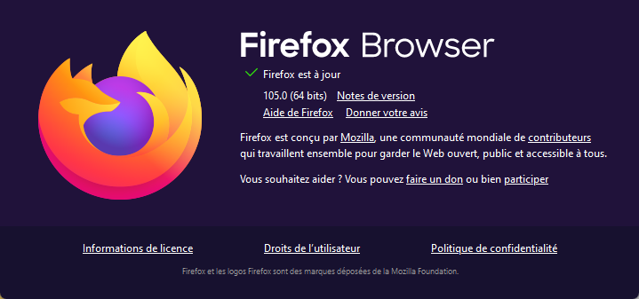

# Sécuriser sa vie privée en ligne

## Sécuriser son navigateur Internet

Les navigateurs stockent énormément de données associées à la vie privée de l'utilisateur: mots de passe, sites visités, cookies... L'analyse de ces données permet de dresser un profil précis de l'utilisateur.

Il est donc indispensable de sécuriser l'utilisation de son navigateur internet. Cela passe par:

* **La sécurisation des mots de passe enregistrés**: de nombreux navigateurs proposent de mémoriser les mots de passe que vous utilisez pour accéder aux services en ligne. Cette fonctionnalité est devenue indispensable tant il devient pénible de devoir renseigner les formulaires d'authentification. En revanche, par défaut, les mots de passe enregistrés par le navigateur sont directement accessibles: il suffit de naviguer dans les menus de paramétrage du navigateur pour voir les mots de passe des sites que vous visitez. Le libre accès aux mots de passe enregistrés constitue une faille de sécurité béante. Il est indispensable de protéger l'accès à la base de mots de passe enregistrés du navigateur.
* **La suppression de toutes les traces de navigation**: par défaut, les navigateurs les plus couramment utilisés enregistrent votre historique de navigation (les liens vers les sites que vous visitez), ainsi que tout un tas de "données techniques" lié à votre navigation (typiquement, les fameux "cookies"). Ces "données techniques" contiennent énormément d'information exploitée pour vous identifier et vous "traquer" en ligne très efficacement, pendant que vous "surfez" sur le WEB. Ces "données techniques" peuvent également être utilisées "hors ligne" par des individus (pirates ou autres) qui chercheraient à collecter de l'information sur vous. L'existence de cette base de "données techniques", directement accessibles (depuis votre PC) constitue un risque énorme pour votre vie privée. Il est indispensable de supprimer ces "données techniques" sitôt qu'elles ne sont plus indispensables (à la navigation sur le WEB). Fort heureusement, les navigateurs sérieux, respectueux de la vie privée de leurs utilisateurs, peuvent être configurés pour supprimer leur base de "données techniques" sitôt que vous fermez le navigateur.

Avant d'aller plus loin, la première chose à faire est de **ne plus utiliser Chrome**. Chrome est un véritable "outil de collecte de données et de traçage".

Dans ce document, nous présentons l'utilisation des navigateurs suivants:
* [Firefox](https://www.mozilla.org/fr/firefox/new/) version `105.0` (64 bits)
* [Brave](https://try.bravesoftware.com/) version `1.43.93` Chromium: `105.0.5195.127` (Build officiel) (64 bits)

**Note**: certains sites marchands ne sont pas compatibles avec Firefox. Dans ce cas, vous pouvez utiliser Brave. N'oubliez pas de signaler le problème au site marchand en insistant que ce dernier, en ne rendant pas son site utilisable avec Firefox, incite ses clients à utiliser Chrome. Et, ce faisant, il encourage la collecte d'information sauvage par Google d'information relative à la vie privée de ses clients.

### Utilisation de Firefox

Ce document a été rédigé en se basant sur la version `105.0` (64 bits) de Firefox:

#### Sécurisation des mots de passe enregistrés

Firefox permet de sécuriser l'accès à sa base de mots de passe sauvegardés, ainsi que l'utilisation de cette dernière, par un mot de passe, appelé "mot de passe principal" (exigé au démarrage du navigateur).

Procédure à suivre pour définir un "mot de passe principal" : https://support.mozilla.org/fr/kb/utiliser-mot-passe-principal-proteger-identifiants

Veuillez noter que la documentation en ligne publiée par Mozilla peut être imprécise ou présenter quelques petites erreurs. Sur mon installation de Firefox (à jour à l'heure où ces lignes ont été écrites), la procédure pour définir le mot de passe principal est légèrement différente de celle présentée sur la documentation officielle. Ci-dessous, vous trouverez la procédure à suivre pour la version `105.0` (64 bits) de Firefox (en français).

Dans le bandeau de commande de Firefox, cliquez sur l'icône ci-dessous (en haut, à droite):

Puis, sur:

`Paramètres` => `Vie privée et sécurité` => `Utiliser un mot de passe principal`

#### Suppression de toutes les traces de navigation

Firefox peut être configuré de façon à ce qu'il supprime toutes les traces de navigation lorsque vous mettez fin à son exécution. On parle de "navigation privée".

Procédure à suivre pour activer la "navigation privée": https://support.mozilla.org/fr/kb/navigation-privee-naviguer-avec-firefox-sans-enregistrer-historique

Veuillez chercher la section intitulée "_Paramétrer Firefox pour utiliser automatiquement la navigation privée_". Cette section présente la procédure à suivre pour définir le mode de navigation privé comme mode par défaut.

Veuillez noter que vous pouvez:
* Démarrer une fenêtre (ou un onglet) de navigation privée "à usage unique". Lorsque cette fenêtre (ou cet onglet) est fermé, toutes les traces de navigation sont supprimées.
* Configurer Firefox de telle façon que le mode de navigation privé soit le mode par défaut, activé automatiquement au démarrage de l'application. Cette configuration est recommandée. Le texte qui suit résume la procédure à suivre pour définir le mode de navigation privé en tant que mode par défaut.

Dans le bandeau de commande de Firefox, cliquez sur l'icône ci-dessous (en haut, à droite):

Puis, sur:

`Paramètres` => `Vie privée et sécurité` => `Historique`... (Règles de conservation), puis sélectionner "Ne jamais conserver l'historique".

