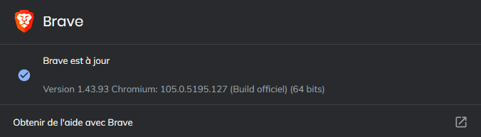
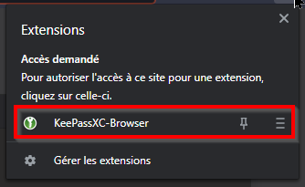

# Brave configuration

Ce document a été rédigé en se basant sur la version version `1.43.93` Chromium: `105.0.5195.127`(64 bits) de Brave:

## Sécurisation des mots de passe enregistrés

Brave intègre un gestionnaire de mots de passe, malheureusement, il n'est pas possible de sécuriser l'accès à ce dernier par un mot de passe. Par conséquent, il est important de désactiver l'utilisation de ce gestionnaire.

Heureusement, il est possible d'utiliser un gestionnaire de mots de passe externe via l'installation d'un plugin. Nous conseillons d'utiliser [KeePassXC](https://keepassxc.org/).

### Désactivation du gestionnaire de mots de passe intégré

Procédure pour désactiver l'utilisation du gestionnaire de mot de passe intégré à Brave:

Dans le bandeau de commande de Brave, cliquez sur l'icône ci-dessous (en haut, à droite):

Puis, sur:

`Saisie automatique` => `Mots de passe`.

Puis désactiver les fonctions suivantes:

* Proposer d'enregistrer les mots de passe
* Connexion automatique

### Utilisation de KeePassXC

Procédure à suivre pour l'utilisation du gestionnaire de mot de passe [KeePassXC](https://keepassxc.org/):

* Installer l'application [KeePassXC](https://keepassxc.org/) sur votre poste de travail.
* Installer le plugin Chromium [KeePassXC-Browser](https://chrome.google.com/webstore/detail/keepassxc-browser/oboonakemofpalcgghocfoadofidjkkk) sur Brave.

Une fois intallé, le plugin est accessible en cliquant sur l'icône ci-dessous:

Une fois le plugin Chromium KeePassXC-Browser installé sur le navigateur, il faut configurer le plugin et l'application:

Attention: 

Les URLs **des formulaires d'authentification** doivent être renseignées dans l'application KeePassXC (sinon le plugin ne trouvera pas les identifiants de connexion).

Si un formulaire d'identification est affiché sur une page, le plugin interroge l'application KeePassXC afin de déterminer si des paramètres d'identification sont disponibles pour ce formulaire. Le cas échéant, le logo de l'application KeePassXC est visible sur le formulaire.

