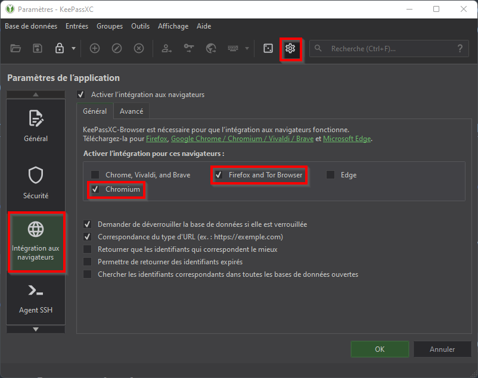
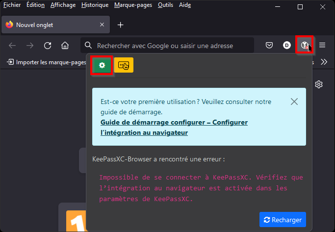
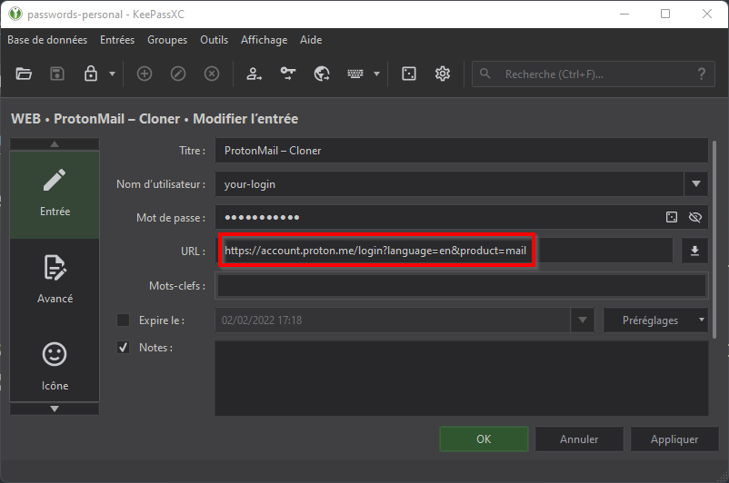

# Gestion de mots de passe: la solution KeepassXC

## Présentation

[KeepassXC](https://keepassxc.org/) est une solution libre, gratuite, pratique et sérieuse pour la gestion de vos mots de passe.

À la différence de la grande majorité des solutions payantes qui stockent vos mots de passe "dans le cloud" (sur des serveurs), KeepassXC stocke les mots de passe sur le disque dur de votre ordinateur. Cette particularité présente des avantages et des inconvénients. La solution parfaite n'existe pas...

Avantage du stockage des mots de passe localement (sur le disque de votre ordinateur):

* **Les mots de passe ne sortent pas de chez vous!** Certaines personnes ne font pas confiance à un tiers pour le stockage de leurs mots de passe. L'idée que l'ensemble de ses mots de passe soient stockés sur les serveurs d'un tiers, accessible par une équipe technique, peut, à juste titre, générer de la crainte. Veuillez noter que cette crainte n'est pas justifiée, car la base de mots de passe est sauvegardée après avoir été chiffrée. Le propriétaire du "cloud", ainsi que son équipe technique, ne possède pas la clé de déchiffrement (et donc, ne peut pas accéder aux mots de passe). Cependant, les utilisateurs paranoïaques sont rassurés à l'idée que leurs mots de passe sont stockés chez eux... et pas quelque part, on ne sait où, sur des serveurs accessibles à un grand nombre de personnes.
* **Vos mots de passe sont toujours accessibles!** Imaginez que vos mots de passe soient stockés sur le "cloud" de l'entreprise "SuperCyber". Que se passerait-il si "SuperCyber" se faisait pirater ? Que se passerait-il si une coupure du réseau rendait le "cloud" de "SuperCyber" inaccessible ? Réponse: vous ne pourriez pas accéder à vos mots de passe. Avouez que ce serait ballot!

Inconvénient du stockage des mots de passe localement (sur le disque de votre ordinateur):

**La synchronisation de la base de mots de passe entre plusieurs machines est délicate.** Si vous utilisez plusieurs ordinateurs, synchroniser votre base de mots de passe entre tous vos ordinateurs demande une certaine rigueur. Les solutions payantes qui stockent votre base de mots de passe sur un "cloud" rendent la synchronisation de la base complètement transparente.

**Vous ne perdez pas vos mots de passe si votre ordinateur rend l'âme.** Imaginez que votre ordinateur périsse dans un incendie. Vos mots de passe étant stockés sur un "cloud", vous pouvez toujours les récupérer! Veuillez noter, cependant, que, si vous stockez votre base de mots de passe localement, sur le disque dur de votre ordinateur, rien ne vous empêche de faire des sauvegardes! Vous pouvez sauvegarder la base de mots de passe sur un "cloud", par exemple... ou sur quelques clés USB.

## Installation de KeepassXC sur votre ordinateur

Documentation en ligne: https://keepassxc.org/docs/KeePassXC_GettingStarted.html#_welcome

La procédure d'installation est très classique: vous téléchargez l'installateur conçu pour le système d'exploitation que vous utilisez (Windows, Max ou Linux) puis vous lancer l'installateur et suivez les instructions.

> Sous Windows, le chemin (par défaut) vers l'application KeepassXC est le suivant: `"%PROGRAMFILES%\KeePassXC"\KeePassXC.exe`
>
> Si vous souhaitez prendre des copies d'écran de l'application, vous devez la lancer via la ligne de commande, en spécifiant l'option `--allow-screencapture`. Ouvrez une "fenêtre DOS" et exécutez la commande suivante: `"%PROGRAMFILES%\KeePassXC"\KeePassXC.exe --allow-screencapture`

## Installation et configuration du plugin KeePassXC-Browser pour les navigateurs 

### Installation

Documentation en ligne: https://keepassxc.org/docs/KeePassXC_GettingStarted.html#_install_the_browser_extension

Là aussi, la procédure d'installation est classique et ne présente aucune difficulté.

### Configuration

La configuration du plugin KeePassXC-Browser nécessite de configurer également l'application KeepassXC au préalable.

Configuration de l'application KeepassXC: https://keepassxc.org/docs/KeePassXC_GettingStarted.html#_configure_keepassxc_browser

En résumé, vous devez activer l'intégration avec les plugins installés sur les navigateurs.

Une fois l'application KeepassXC configurée, vous devez configurer le plugin KeePassXC-Browser.

En résumé:

1. Assurez-vous que l'application KeePassXC s'exécute et a été déverrouillée (via l'entrée du mot de passe).

2. Assurez-vous que l'application KeePassXC est bien configurée pour autoriser la connexion du plugin KeePassXC-Browser à installer sur votre navigateur (Firefox, Chrome, Chromium, Brave...).

3. Dans le navigateur, cliquez sur l'icône du plugin.

4. Cliquez sur `Bases de données connectées` => `Connecter`

5. Dans la fenêtre qui s'ouvre, entrez un nom de connexion.

À ce stade, le navigateur fera appel à l'application KeePassXC pour renseigner les formulaires d'authentification.

Attention: afin que le KeePassXC renseigne les paramètres d'un formulaire d'authentification, vous devez renseigner l'URL (exacte) de la page qui contient le formulaire. Par exemple:

